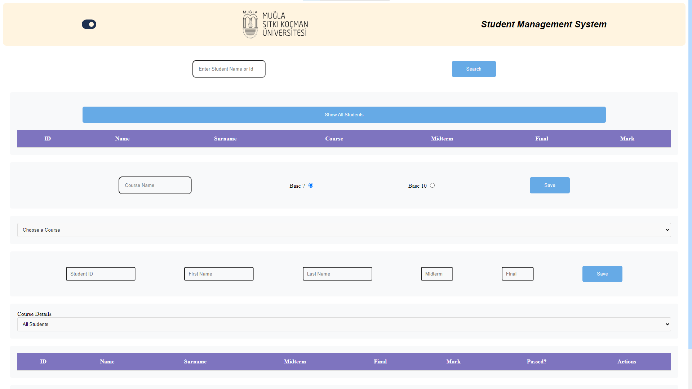
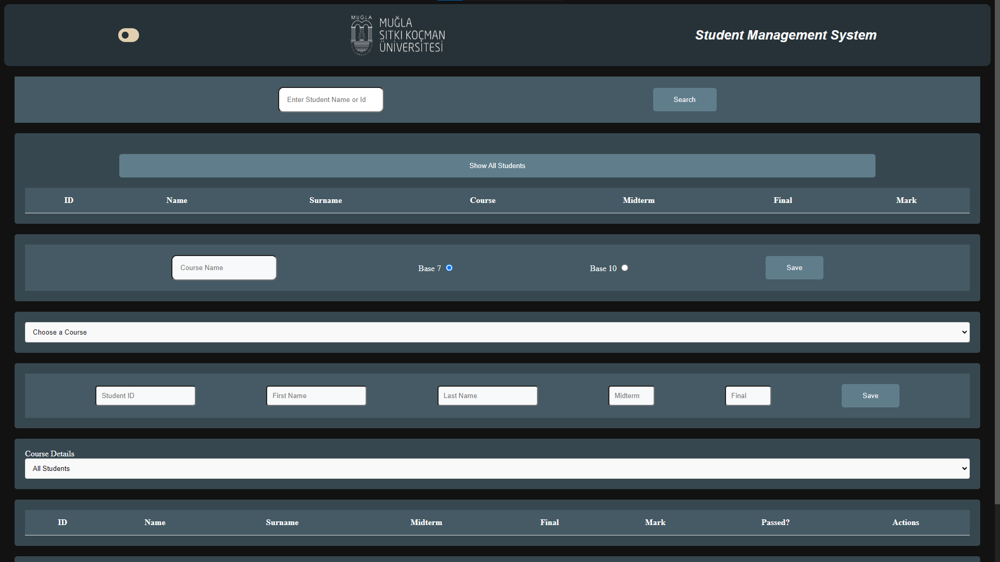

# Student Management System

A web-based application for managing student information and course data.

## Features:

Student Management:
Add, edit, and delete student records.
Search for students by name or ID.
View student details, including midterm, final, and overall marks.
Course Management:
Create new courses with different bases (7 or 10).
View course details, including the number of passed and failed students, average mark, and base.
Manage student enrollment in courses.
Detailed Course Views:
View lists of all students in a course, with options to filter for passed or failed students.
See individual student grades within a course.
## Technologies Used:

HTML
CSS
JavaScript
## Getting Started:

Clone this repository:
Bash
git clone https://github.com/akifalbayrak/student-management-system.git
Kodu kullanırken dikkatli olun. Daha fazla bilgi
Open the index.html file in your web browser.
## Usage:

Use the search bar to find students by name or ID.
Click the "Show All Students" button to view all students.
Use the "courses" select element to choose a course and view its details.
Use the "Course Details" select element to view different course statistics.
Fill out the forms to add new courses and students.

